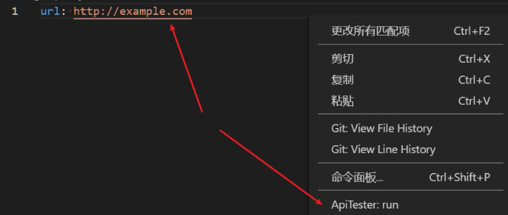
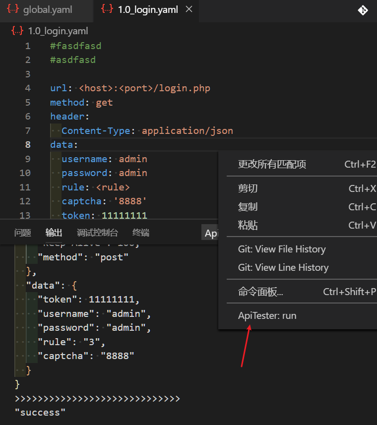
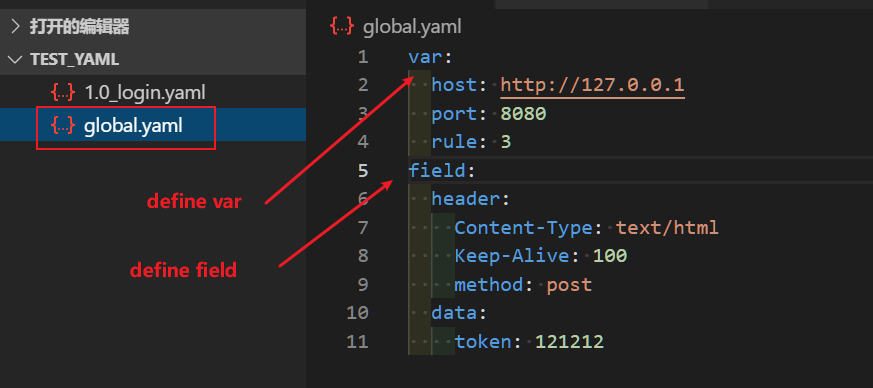
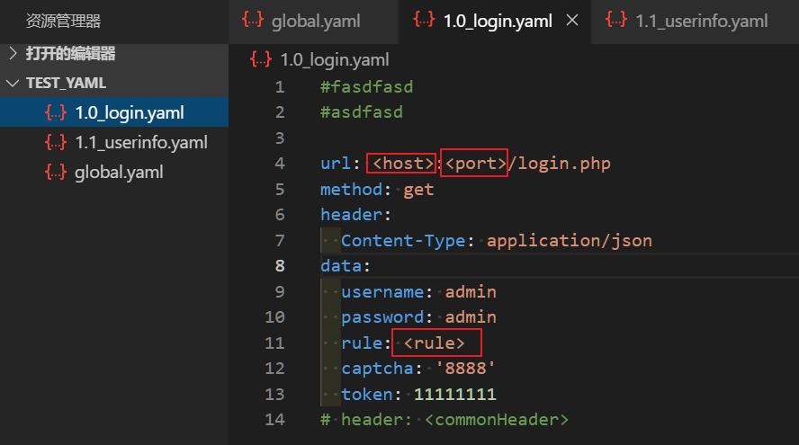

# ApiTester README

ApiTester is a postman like api test extension for vscode.

## Features
use .yaml file define request;

global.yaml define global vars and fields;

Available field : url, method, header, data, params;

# Quick start

-------------
# Advanced

-------------

-------------

## Release Notes

### 0.0.1

Base function

### 0.0.3

Update readme

